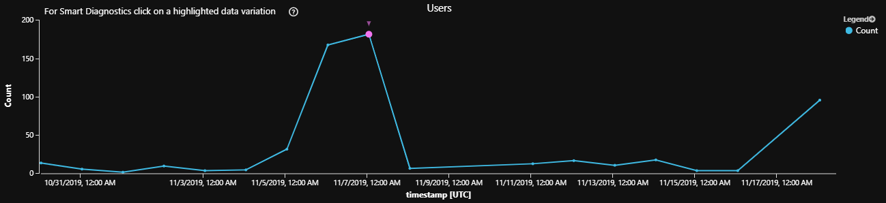
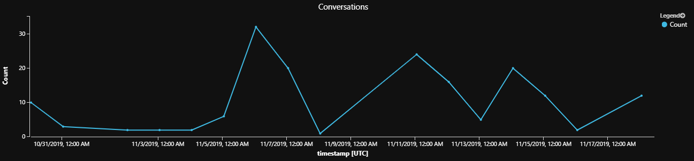
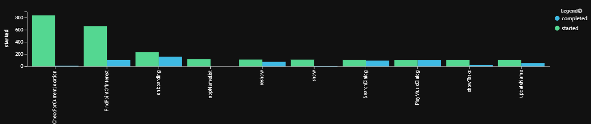
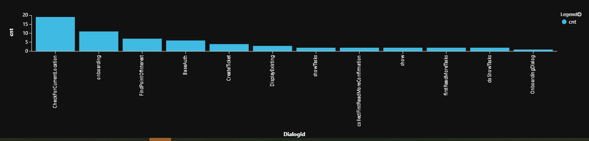
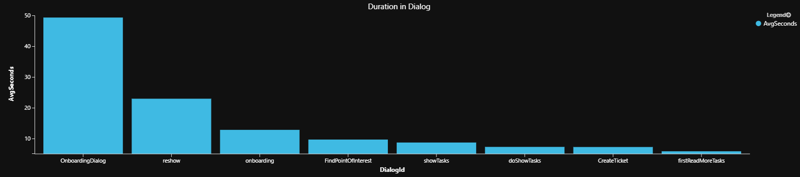
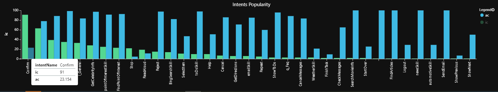
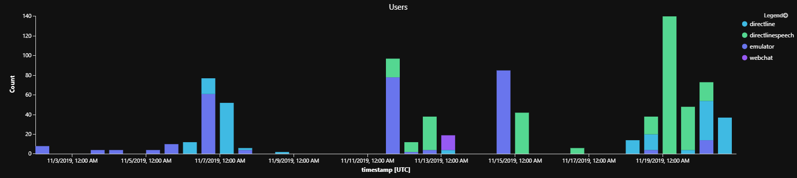

# Bot Behavior Analytics Queries

The following collection of queries can be used to analyze bot behavior. You can use the collection to author custom queries in Azure log analytics and to create monitoring and PowerBI visualization dashboards.

For all queries below we recommend that the design uses common selectors for pivots around period, channel, and locale.


## Queries

### Number of users per period

* Count distinct users of bot per period.

- Popularity of the bot per period (configured)
- Caveat: unique users is inaccurate unless using authenticated users, and it depends on the channel capabilities.

#### Query
```sql
// number of users per period
let period = ago(20d);
let bucket = 1d;
customEvents 
| where timestamp > period
| summarize uc=dcount(user_Id) by bin(timestamp, bucket)
| render timechart
```
#### Sample View




### Activity per period

* Measures volume of activity per desired dimension: counts number of conversations, dialogs, or messages per period
* Assign *metric* desired dimension to display:
  * *InstanceId* measures Conversations
  * *DialogId* measures Dialogs
  * *ActivityId* measures Messages


```sql
// number of activity measure (conversations, dialogs) per period per dialogs
let period = ago(20d);
let bucket = 1d;
customEvents 
| where timestamp > period
| extend InstanceId = tostring(customDimensions['InstanceId'])
| extend DialogId = tostring(customDimensions['DialogId'])
| extend ActivityId = tostring(customDimensions['activityId'])
| where DialogId != '' and  InstanceId != '' and user_Id != ''
| extend metric = InstanceId // DialogId or ActivityId
| summarize Count=dcount(metric) by  bin(timestamp, bucket)
| order by Count desc nulls last 
| render timechart
```

#### Sample View




### Dialog completion

* Measures *completed* dialogs relative to *started* dialogs
* If number of started dialogs is much greater than number of completed, users do not complete the dialog flow. Troubleshoot dialog logic.
* Also shows popular and less frequented dialogs.

```sql
// % Completed Waterfall Dialog: shows completes relative to starts 
customEvents
| where timestamp > ago(90d)     // change timespan accordingly
| where name=="WaterfallStart"
| extend DialogId = customDimensions['DialogId']
| extend InstanceId = tostring(customDimensions['InstanceId'])
| join kind=leftouter (
    customEvents 
    | where name=="WaterfallComplete" 
    | extend InstanceId = tostring(customDimensions['InstanceId'])
  ) on InstanceId    
| summarize started=countif(name=='WaterfallStart'), completed=countif(name1=='WaterfallComplete') by tostring(DialogId)
| where started > 100  // filter for sample
// Show starts vs. completes
| project tostring(DialogId), started, completed
| order by started desc, completed asc  nulls last 
| render barchart  with (kind=unstacked, xcolumn=DialogId, ycolumns=completed, started, ysplit=axes) 
```

#### Sample View




### Dialog incompletion

* Measures dialog flows that have started but never completed due to cancellation or abandonment
* Review incomplete dialogs & examine whether they were actively cancelled due to misunderstanding user intent for example or abandonment such as due to user distraction or loss of interest.

```sql
// show incomplete dialogs
let period = ago(10d);
customEvents 
| where timestamp > period 
| where name == "WaterfallStart" 
| where timestamp > period    // change timespan accordingly
| extend DialogId = customDimensions['DialogId']
| extend instanceId = tostring(customDimensions['InstanceId'])
| join kind=leftanti (
  customEvents
  | where name == "WaterfallComplete" 
  | extend instanceId = tostring(customDimensions['InstanceId'])
  ) on instanceId
| summarize cnt=count() by  tostring(DialogId)
| order by cnt
| render barchart
```

#### Sample View




### Activity per user per period

Count number of dialogs or conversations or messages per user per period.

- Measures user interaction volume with bot as measured by dialogs or conversations or messages
- Days with lots of activity by a single user may mean attack or test
- Days with little interaction may indicate service health issues
- Variation: remove per user to understand general bot volume activity (pivoted on time and dialogs, messages, or conversations)

### Query

```sql
// number of users per period per dialogs
let period = ago(10d);
let bucket = 6h;
customEvents 
| where timestamp > period
| extend InstanceId = tostring(customDimensions['InstanceId'])
| extend DialogId = tostring(customDimensions['DialogId'])
| extend ActivityId = tostring(customDimensions['activityId'])
| where DialogId != '' and InstanceId != '' and user_Id != ''
| extend metric = ActivityId // InstanceId // DialogId // or InstanceId for conversation count
| summarize Count=dcount(metric) by user_Id, bin(timestamp, bucket)
| order by Count desc nulls last 
```

#### Sample View 

\# of dialogs per user per period

| **user_Id**   | **timestamp**        | **Count** |
| ------------- | -------------------- | --------- |
| User-8107ffd2 | 2019-09-03T00:00:00Z | 14        |
| User-75f2cc8f | 2019-08-30T00:00:00Z | 13        |
| User-75f2cc8d | 2019-09-03T00:00:00Z | 13        |
| User-3060aada | 2019-09-03T00:00:00Z | 10        |


### Drill Down Dialog Sequence

Shows sequence of dialog steps, grouped by conversation (instanceId). 

* Useful to get insights into which step may lead to dialog interruption. 

#### Waterfall start/step/complete for dialog in conversation

```sql
// Drill down: Show waterfall start/step/complete for specific dialog
let DialogActivity=(dlgid:string) {
customEvents
| where timestamp > ago(20d)
| extend DialogId = customDimensions['DialogId']
| extend StepName = customDimensions['StepName']
| extend InstanceId = customDimensions['InstanceId']
| where DialogId == dlgid
| project timestamp, name, StepName, InstanceId 
| order by tostring(InstanceId), timestamp asc
};
// For example see FindPointOfInterestBeforeRoute behavior
DialogActivity("FindPointOfInterestBeforeRoute")
```

##### Sample view

| **timestamp**       | **name**                 | **StepName**                    | **InstanceId**  |
| ------------------- | ------------------------ | ------------------------------- | --------------- |
| 2019-08-23T20:04... | **WaterfallStart **      | null                            | ...79c0f03d8701 |
| 2019-08-23T20:04... | WaterfallStep            | GetPointOfInterestLocations     | ...79c0f03d8701 |
| 2019-08-23T20:04... | WaterfallStep            | ProcessPointOfInterestSelection | ...79c0f03d8701 |
| 2019-08-23T20:04... | WaterfallStep            | GetRoutesToDestination          | ...79c0f03d8701 |
| 2019-08-23T20:05... | WaterfallStep            | ResponseToStartRoutePrompt      | ...79c0f03d8701 |
| 2019-08-23T20:05... | **WaterfallComplete *1** | null                            | ...79c0f03d8701 |
| 2019-08-28T23:35... | WaterfallStart           | null                            | ...6ac8b3211b99 |
| 2019-08-28T23:35... | *WaterfallStep*__\*__2   | GetPointOfInterestLocations     | ...6ac8b3211b99 |
| 2019-08-28T19:41... | WaterfallStart           | null                            | ...8137d76a5cbb |
| 2019-08-28T19:41... | *WaterfallStep*__\*2__   | GetPointOfInterestLocations     | ...8137d76a5cbb |

**\*1 Completed**

**\*2 Abandoned**

_Interpretation: Users seem to abandon the conversation at the GetPointOfInterestLocations step._ 

#### Waterfall start/step/complete/cancel steps aggregate totals

```sql
// Drill down: Aggregate view of waterfall start/step/complete/cancel steps totals for specific dialog
let DialogSteps=(dlgid:string) {
customEvents
| where timestamp > ago(20d)
| extend DialogId = customDimensions['DialogId']
| where DialogId == dlgid
| project name
| summarize count() by name
};
// For example see FindPointOfInterestBeforeRoute behavior
DialogSteps("FindPointOfInterestBeforeRoute")
```

##### Sample view

| **name**          | **count_** |
| ----------------- | ---------- |
| WaterfallStart    | 21         |
| WaterfallStep     | 47         |
| WaterfallComplete | 11         |
| WaterfallCancel   | 1          |

_Interpretation: Of 21 invocations of dialog sequence, only 11 has completed, 9 were abandoned, and one was cancelled by the user_


### Average duration in dialog

Measures duration on average in dialog. Long time spend in dialog may suggest opportunity to simplify.

 ```sql
// Average dialog duration
let period = ago(20d);
customEvents 
| where timestamp > period
| where name=="WaterfallStart"
| extend DialogId = customDimensions['DialogId']
| extend instanceId = tostring(customDimensions['InstanceId'])
| join kind=leftouter (customEvents | where name=="WaterfallCancel" | extend instanceId = tostring(customDimensions['InstanceId'])) on instanceId 
| join kind=leftouter (customEvents | where name=="WaterfallComplete" | extend instanceId = tostring(customDimensions['InstanceId'])) on instanceId 
| extend duration = case(not(isnull(timestamp1)), timestamp1 - timestamp, 
not(isnull(timestamp2)), timestamp2 - timestamp, 0s) // Abandoned are not counted. Alternate: now()-timestamp)
| extend seconds = round(duration / 1s)
| summarize AvgSeconds=avg(seconds) by tostring(DialogId)
| order by AvgSeconds desc nulls last 
| render barchart with (title="Duration in Dialog")
 ```

#### Sample view




### Average steps in dialog

Shows executed dialog "length" on average, min, max and standard deviation. Helps analyze dialog quality. For example:

- Dialogs with many steps shall be evaluated for simplification opportunities
- Dialogs with wide gap between min/max/average may mean: users do not complete, there's shorter paths to complete task, users get stalled in tasks, dialog is complex (possibly by design).
- Dialogs with large standard-deviation suggest complex paths or broken experience (abandon/cancel)
- Dialogs with very few steps may be so because they were never completed. Review relative to     completion/abandonment rates

```sql
// min/max/std/avg steps per dialog
customEvents
| where timestamp > ago(20d) 
| extend DialogId = tostring(customDimensions['DialogId'])
| extend StepName = tostring(customDimensions['StepName'])
| extend InstanceId = tostring(customDimensions['InstanceId'])
| where name == "WaterfallStart" or  name == "WaterfallStep" or  name == "WaterfallComplete" 
| order by InstanceId, timestamp asc
| project timestamp, DialogId, name, InstanceId, StepName 
| summarize cnt=count() by InstanceId, DialogId
| summarize avg=avg(cnt), minsteps=min(cnt),maxsteps=max(cnt), std=stdev(cnt) by DialogId
| extend avgsteps = round(avg, 1)
| extend avgshortbysteps=maxsteps-avgsteps
| extend avgshortbypercent=round((1.0 - avgsteps/maxsteps)*100.0, 1)
| project DialogId, avgsteps, minsteps, maxsteps, std, avgshortbysteps, avgshortbypercent
| order by std desc nulls last 
```

#### Sample view

| Dialog Id               | avg steps | min steps | max steps | std  | avg short by steps | avg short by percent |
| ----------------------- | --------- | --------- | --------- | ---- | ------------------ | -------------------- |
| FindArticlesDialog      | 6.2       | 2         | 7         | 2.04 | 0.8                | 11.4%                |
| CreateTicket            | 4.3       | 2         | 5         | 1.5  | 0.7                | 14%                  |
| CheckForCurrentLocation | 3.9       | 2         | 5         | 1.41 | 1.1                | 22%                  |
| BaseAuth                | 3.3       | 2         | 4         | 1.03 | 0.7                | 17.5%                |
| onboarding              | 2.7       | 2         | 4         | 0.94 | 1.3                | 32.5%                |

__Interpretation: For example, FindArticlesDialog has a wide spread between min/max and should be investigated and possibly redesigned & optimized.


### Total Intents by Popularity

Shows summary of all intents by popularity, and corresponding intent detection certainty score.

* In practice, the view should separated for each metric.
* Popular intents paths should be optimized for user experience.
* Low average scores indicate poor recognition & possible missing actual user intent.

```sql
// show total intents
let period = ago(10d);
customEvents
| where timestamp > period
| where name startswith "LuisResult" 
| extend intentName = tostring(customDimensions['intent'])
| extend intentScore = todouble(customDimensions['intentScore'])
| summarize ic=count(), ac=avg(intentScore)*100 by intentName
| project intentName, ic, ac
| order by ic desc nulls last 
| render barchart with (kind=unstacked, xcolumn=intentName, ycolumns=ic,ac, title="Intents Popularity")
```

#### Sample view



_Interpretation: For example the most popular intent, confirm is detected only with 23% confidence on average._


### Channel activity by activity metric

Measure activity volume per channel by counting metrics: incoming messages or users or conversations or dialogs (per period).

- Useful for service health analysis
- Measure channels popularity
- Variations: 
  - Consider removing timestamp bucketing bin(timestamp, bucket)
  - dcount for distinct users vs count for all user event activities (even with repeated users)


```sql
// number of metric: messages, users, conversations, dialogs by channel
let period = ago(14d);
let bucket = 1d;
customEvents 
| where timestamp > period
| extend InstanceId = tostring(customDimensions['InstanceId'])
| extend DialogId = tostring(customDimensions['DialogId'])
| extend ActivityId = tostring(customDimensions['activityId'])
| extend ChannelId = tostring(customDimensions['channelId'])
| where DialogId != '' and  InstanceId != '' and user_Id != ''
| extend metric = user_Id // InstanceId or ActivityId or user_Id
| summarize Count=count(metric) by  ChannelId, bin(timestamp, bucket)
| order by Count desc nulls last 
| render barchart with (title="Users", kind=stacked) // or Incoming Messages or Conversations or Users

```

#### Sample view



 _Interpretation: Emulator testing used to be most popular but once we went live, DirectLineSpeech, is the most popular channel._


## Schema of Bot Analytics Instrumentation

The fields used in the queries above are as follows.

** TBD - Initial stub

### General Envelope

Common log analytics fields in Application Insights instrumentation.

| **Attribute**    | **Description**        | **Sample Values**                                            |
| ---------------- | ---------------------- | ------------------------------------------------------------ |
| name             | Message type           | BotMessageSend, BotMessageReceived, LuisResult, WaterfallStep, WaterfallStart, SkillWebSocketProcessRequestLatency, SkillWebSocketOpenCloseLatency, WaterfallComplete, QnaMessage, WaterfallCancel, SkillWebSocketTurnLatency, AuthPromptValidatorAsyncFailure |
| customDimensions | SDK Bot Analytics (!)  | activityId=\<id>,  activityType=message,  channelId=emulator,  fromId=\<id>,  fromName=User,  locale=en-us,  recipientId=\<id>,  recipientName=Bot,  text=find  a coffee shop |
| timestamp        | Time of event          | 2019-09-05T18:32:45.287082Z                                  |
| instance_Id      | ~Conversation Id       | f7b2c416-a680-4b2c-b4cc-79c0f03d8711                         |
| operation_Id     | ~Turn Id               | 084b2856947e3844a5a18a8476d99aaa                             |
| user_Id          | Unique channel user id | emulator7c259c8e-2f47...                                     |
| client_IP        | Client ip address      | 127.0.0.1 (may be absent due to privacy block)               |
| client_City      | Client city            | Redmond (if detected, may be absent)                         |

### Custom Dimensions

Most of bot specific activity data is stored in _customDimensions_ field.

| **Attribute** | **Description**      | **Sample Values**                                 |
| ------------- | -------------------- | ------------------------------------------------- |
| activityId    | Message id           | \<id>: 8da6d750-d00b-11e9-80e0-c14234b3bc2a       |
| activityType  | Type of message      | message, conversationUpdate,  event, invoke       |
| channelId     | Channel identifier   | emulator, directline, msteams,  webchat           |
| fromId        | From Identifier      | \<id>                                             |
| fromName      | Username from client | John Bonham, Keith Moon, Steve Smith,  Steve Gadd |
| locale        | Client origin locale | en-us, zh-cn, en-GB,  de-de, zh-CN                |
| recipientId   | Recipient identifier | \<id>                                             |
| recipientName | Recipient name       | John Bonham, Keith Moon, Steve Smith,  Steve Gadd |
| text          | Text in message      | find a coffee shop                                |

### Custom Dimensions: LUIS

LUIS instrumentation stores its data in the following Custom Dimensions fields.

| **Attribute**  | **Description**         | **Sample Values**                                       |
| -------------- | ----------------------- | ------------------------------------------------------- |
| intent         | LUIS detected intent    | pointOfInterestSkill                                    |
| intentScore    | LUIS recognition score  | 0.98                                                    |
| Entities       | LUIS detected entities  | FoodOfGrocery =  [["coffee"]], KEYWORD= ["coffee shop"] |
| Question       | LUIS detected question  | find a coffee shop                                      |
| sentimentLabel | LUIS detected sentiment | positive                                                |

### Custom Dimensions: QnAMaker

QnAMaker instrumentation stores its data in the following Custom Dimensions fields.

| **Attribute**   | **Description**            | **Sample Values**                                            |
| --------------- | -------------------------- | ------------------------------------------------------------ |
| question        | QnA detected question      | what can you do?                                             |
| answer          | QnA answer                 | You have questions, I may have  answers.                     |
| articleFound    | QnA                        | true                                                         |
| questionId      | QnA question Id            | 488                                                          |
| knowledgeBaseId | QnA KB Id                  | 2a4936f3-b2c8-44ff-b21f-67bc413b9727                         |
| matchedQuestion | Array of matched questions | ["Can you explain to me what your  role is?","Can  you tell me a bit about yourself?","Can  you tell me about you?","could  you help me","hmmm so  what can you do?","how  can you help me","How  can you help me?","How  can you help?","so  how can i  use you in my projects?","Talk to  me about your capability","What  are you capable of?",… |


## Sample Dashboard Design **TBD

This is a sample design of bot behavior analytics dashboard

### Summaries Page

* Number of users per period
* Number of conversations per period
* Number of messages per period

### Dialogs Page

* Dialog Popularity: number of dialogs invoked by dialog id per period
* Total duration in dialog by dialog id per period
* Steps per dialog analysis (total, average, min/max/std)
* Total messages by dialog id per period
* Dialog Status: total completed, cancelled, abandoned

### Channels Page (alternative to selector)

* Number of messages per channel per period
* Number of conversations per channel per period
* Number of users per channel per period

### Cognitive Services Page

* Total count intents relative to intent scores
* Total dialogs invoked by intent
* Dialogs completed/cancelled/abandoned by intent (*TBD stretch/brainstorm)
* Defer drill downs to Luis & QnAMaker analytics pages (*TBD pointer?)

### Conversation Analysis Page

* Conversation duration
* Conversation log
* User utterances log
* User utterances popularity
* Bot response popularity

### Transcript Page

* View transcript log
* Search and pivot view transcript by:
  * User-Id
  * dialog-id
  * time
  * User utterance text
* Bot response text

 

## See Also

* Learn how to [Add telemetry to your bot](https://aka.ms/AddBotTelemetry).
* Learn more about [Azure Monitor log queries](https://docs.microsoft.com/en-us/azure/azure-monitor/log-query/query-language).
